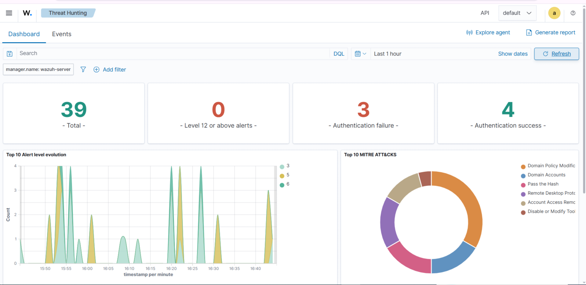

# SOC_Lab_Wazuh
Wazuh SIEM Lab: Attack Simulation &amp; Detection  A technical project simulating a full cyber-attack lifecycle—from Nmap reconnaissance to Hydra brute-force and Metasploit exploitation—demonstrating real-time detection, log analysis, and incident response using Wazuh SIEM

# 🛡️ SOC Lab: Attack Simulation & Detection with Wazuh SIEM

## 📝 Project Overview
This project demonstrates a complete cybersecurity workflow within a virtualized lab environment. It covers the full lifecycle of a cyber-attack—from reconnaissance to exploitation—and focuses on how to detect and respond to these threats using **Wazuh SIEM**.

---

## 📸 Lab Highlight: Wazuh Dashboard

*Figure 1: Wazuh Dashboard showing the correlation between Metasploit exploitation and real-time security alerts.*

---

## 🛠️ Tools & Technologies
| Category | Tools Used |
| :--- | :--- |
| **SIEM / Monitoring** | Wazuh (Manager & Agent) |
| **Attacking Platform** | Kali Linux |
| **Reconnaissance** | Nmap |
| **Exploitation** | Metasploit, Hydra |
| **Target Machine** | Windows 10 / Server |

---

## 🚀 Key Activities
1. **Reconnaissance:** Performed network scanning using `Nmap` to identify open ports and services.
2. **Brute-Force Attack:** Simulated a password cracking attempt using `Hydra`.
3. **Exploitation:** Used `Metasploit` to gain unauthorized access to the target system.
4. **Detection & Analysis:** Monitored all activities via the **Wazuh Dashboard**, analyzed logs, and mapped alerts to the **MITRE ATT&CK** framework.

---

## 👤 Project Owner
* **Ali Dalla** - [LinkedIn Profile](https://www.linkedin.com/in/ali-dalla-5a9774398/)

---

## 📄 Documentation
For a deep dive into the technical details, step-by-step procedures, and full analysis, please refer to the technical report:
👉 **[Download Full PDF Report](./Ali_Dalla_SOC_Lab_Report.pdf)**

---
*This project was completed as part of the SOC Core Skills training with **Cyberpedia**.*
